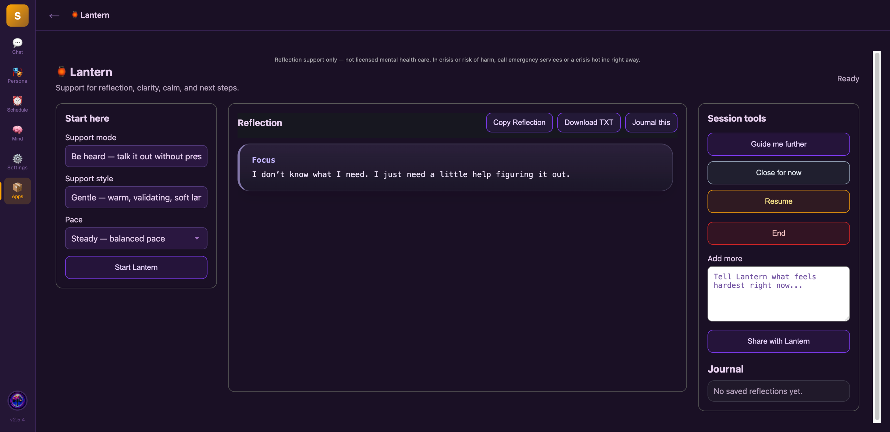

# Lantern 🏮

A quiet space in Sapphire to talk things through, reflect, and find a next step.

Lantern is a [Sapphire](https://github.com/ddxfish/sapphire) plugin for guided conversation and journaling. Choose the support you want, select a response style and pace, and keep useful reflections in your journal.

[Sapphire Store](https://sapphireblue.dev/plugins/lantern/) · [Releases](https://github.com/shroomshaolin/Lantern/releases) · [Report a problem](https://github.com/shroomshaolin/Lantern/issues)

## Interface preview

This screenshot shows an earlier interface; controls may vary by version.

## Choose the conversation you need

| Support mode | Focus |
| --- | --- |
| Be heard | Talk things out without rushing toward a solution. |
| Get clear | Separate feelings, facts, needs, and options. |
| Calm down | Explore grounding and a steadier pace. |
| Prepare | Think through a conversation or decision. |
| Reflect | Journal and notice patterns. |
| Spiritual | Explore meaning, grief, hope, and conscience. |

Choose a **Gentle, Practical, Direct, Deep, or Spiritual** response style. The pace selector adjusts the requested depth of the exchange. These are support settings, not two independent personas.

Add context, select **Guide me further**, copy a reflection, download it as text, or save it with **Journal this**.

Lantern provides AI reflection support, not licensed mental health care, diagnosis, or emergency assistance. Responses can be mistaken; seek qualified human support when needed.

## Requirements and installation

You need a running Sapphire installation with a configured language model. Lantern requires Sapphire's `LLMChat.isolated_chat` method to keep its replies out of the active main chat. An exact minimum Sapphire version has not been established.

1. In Sapphire, open **Settings → Plugins → Install Plugin**.
2. Paste `https://github.com/shroomshaolin/Lantern`.
3. Install it, check its signature status, and enable Lantern.
4. Open **Apps → Lantern**. Reload the interface or restart Sapphire if it does not appear.

For manual installation, place the repository's root contents in `<Sapphire>/user/plugins/lantern/`, with `plugin.json` directly inside that folder.

## Start a reflection

1. Select a support mode, response style, and pace.
2. Describe what is on your mind and select **Start Lantern**.
3. Add context through **Share with Lantern** or choose **Guide me further**.
4. Use **Journal this** or **Download TXT** to preserve a reflection.

## Troubleshooting and privacy

- **Missing `isolated_chat`:** use a compatible Sapphire build or an explicitly tested compatibility fix.
- **“Tampered” or hash mismatch:** do not bypass verification. Use an intact signed release or have the author re-sign changes with their authorized key. Even README edits require re-signing; see [Sapphire's signing guide](https://github.com/ddxfish/sapphire/blob/main/docs/plugin-author/signing.md).
- **No reply:** confirm that Sapphire's configured model works, then check its logs for a redacted provider or plugin error.

Journal history uses the plugin's `data/history.json`. Back it up before replacing or removing an installation. Cloud providers may receive the text you submit; a separate reflection window does not guarantee local processing or encryption. Provider charges depend on your configuration.

For bug reports, include plugin and Sapphire versions, model/provider, reproduction steps, and a redacted error. Keep API keys and personal journal entries out of public issues.

## More by Donna

[Rendezvous](https://github.com/shroomshaolin/rendezvous) hosts conversations between two personas. [The Peg & Pint](https://github.com/shroomshaolin/peg-and-pint) brings a cribbage table to Sapphire.

## License

[MIT](LICENSE).
